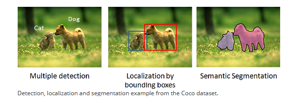

---

TL;DR:

This article is a very short and gentle introduction to the concept of Machine Learning (ML) as defined in the Statistical Learning framework.

ML algorithms, often called learners, learn patterns in a dataset. It is assumed there exists an underlying (unknown) probability distribution which the data is sampled from. This distribution is accompanied by a labelling function (also unknown) that simply assigns a value to each data point. The algorithm then constructs a hypothesis function which approximates this labelling function. The measure of success of approximation is defined by a measure called the loss function.

Since the two above unknowns are unavailable to the learner, we train the learner on a snapshot of data points which we know the label of. The goal of the training is then to tweak the hypothesis function to better approximate the snapshot and hopefully this snapshot is representative of the whole distribution.

Although this article has been written in markdown you can [click here](/ML.pdf) for an unoptimised pdf version.

Lastly you can also [click here](notes/neural-networks-definition) to get the next article in the series!

---

<!-- omit in toc -->

## Table of Contents

- [Introduction](#introduction)
- [What is Machine Learning?](#what-is-machine-learning)
  - [Mathematically Stating Machine Learning Problems](#mathematically-stating-machine-learning-problems)
- [Concluding Remarks](#concluding-remarks)
- [References](#references)

---

# Introduction

This will be the first in a series of articles that I have written for two reasons. Firstly to solidify my knowledge of the mathematical foundations of the subject. Secondly, I am posting the series online to help those, like myself, who are interested in the mathematics of deep learning but find it hard to know where to start or where to look.

I have a friend with a similar mathematical background to myself, studying for a PhD in Mathematical Physics. I would say his research interests lie in geometrically understanding physical theories (some might say he is interested in a version of [Hilbert's sixth problem](https://en.wikipedia.org/wiki/Hilbert%27s_sixth_problem)). He is also interested in the mathematical aspects of deep learning. It is to him that I aim this work and thus the level of mathematics needed is high. One does not need to have a PhD to approach the topic (I do not), but an undergraduate mathematical education will suffice.
The purpose is to provide an insight into the overlap of physics/geometry with machine learning theory. Specifically how the [paper](https://arxiv.org/pdf/1902.04615.pdf) on Gauge-CNN's uses [gauge theory](https://en.wikipedia.org/wiki/Gauge_theory) to solve some problems in modern deep learning (DL) theory.

List of mathematical topics that it is assumed the reader is at least familiar with the notation of the following topics (to be updated as th series expands):

- Measure theory
- Probability theory
- Differential Geometry
- Basic Gauge Theory
- ...

---

# What is Machine Learning?

Machine learning a sub-field of artificial intelligence—a fact that is often abused in modern corporate jargon & by many marketing teams—which is concerned with recognizing patterns in data (usually massive amounts of it). That is the program does not have the patterns explicitly encoded, rather the program actually learns the patterns itself.

Machine learning comes in many forms and has many purposes. It is also much more common place these days than you might have realised. Everything from your recommendations on Netflix & Spotify, your searches on Google, the devices voice assistants that you are constantly carrying and even for employee monitoring in the workplaces of [some financial firms like PwC](https://www.fnlondon.com/articles/finance-bosses-ramp-up-surveillance-of-workers-productivity-20201001) & [Amazon](https://www.theverge.com/2019/4/25/18516004/amazon-warehouse-fulfillment-centers-productivity-firing-terminations)—1984?—uses machine learning!

Over the years, artificial intelligence have seen many portrayals as a (possibly extremely) detrimental technology. Despite this the allure of rapid innovation & using machine learning for good, such as the work of many companies revolutionizing health care, has greatly overcame the dystopian narrative.

Publications in machine learning, specifically deep learning (the topic of the [first article of this series]()), has exploded over the past decade. From numbering in the tens to hundreds of papers a year to the tens of thousands of the last few years.

Not only this but the number of large companies and starts entering the field is humongous, as may be evident from above.

With all that being said we are mathematicians here, so lets get down to the good stuff. Definitions!

---

## Mathematically Stating Machine Learning Problems

A formal model of the task of learning from data is given by the [Statistical Learning](https://en.wikipedia.org/wiki/Statistical_learning_theory#:~:text=Statistical%20learning%20theory%20is%20a,predictive%20function%20based%20on%20data.) framework.

This consists of six main ingredients:

1. **_Domain space_**: The set of all possible inputs
2. **_Output space_**: The set of all possible outputs
3. **_Training data/ dataset_**: A set of examples on input-output pairs that the model will learn from.
4. **_Predictor_**: A function from the domain space to the output space which represents the patterns learned from the training data.
5. **_Data model_**: A probability distribution that we assume is 'responsible' for generating the data.
6. **_Success measure/ Loss function_**: A measure telling us how close our predictor was to the correct output.

Let's define these more rigorously:

> A **_dataset_** $S=\{(x_1, y_1),...,(x_n,y_n)\}_{i\in I}$ is a finite collection of pairs of points in the cartesian product of vector spaces $\mathcal{X}\times\mathcal{Y}$, where $\mathcal{X}$ is called the **_domain space_** & $\mathcal{Y}$ is called the **_output space_**. The dataset consists of $n$ data points indexed by the indexing set $I$.

The goal of the machine learning algorithm is then to learn the patterns that give rise to this input-output correspondence represented by the dataset. It is for this reason that the algorithm is often called the learner.

We postulate that this correspondence is described by an underlying probability distribution. That is, the output space is related to the input space by a **fixed unknown probability distribution** $\mathcal{D}$ over the **data space** $\mathcal{X}\times\mathcal{Y}$ which is _identically and independently distributed_. Meaning that the samples are all generated from the same distribution and have no knowledge of other samples.

> Assuming the existence of a probability space $(\mathcal{X}\times\mathcal{Y}, \mathcal{F}, P)$ where $\mathcal{F}$ is a $\sigma-$algebra over $\mathcal{X}\times\mathcal{Y}$ and $P$ is a probability measure. Then our data is assumed to be random variables sampled from some unknown distribution $\mu:\mathcal{B}\to[0,1]$, $\mathcal{B}$ the set of Borel subsets of $\mathbb{R}$.

> Alternatively one may assume that the sample space is simply $\mathcal{X}$ and then also assume the existence of a **target function** $f:\mathcal{X}\to\mathcal{Y}$ which 'labels' the input space points with some value $y\in\mathcal{Y}$. Herein we shall use $f(x)$ and $y\in\mathcal{Y}$ interchangeably.

To learn the patterns that are assumed to arise from this distribution, we define two functions:

> The **predictor/hypothesis** is a function $h:\mathcal{X}\to\mathcal{Y}$. We suppose that the function belongs to some function space $\mathcal{\Gamma}$ which the leaner then 'searches'.

That is, the hypothesis $h\in A(S)\subset \mathcal{\Gamma}$, where $A(S)$ is the subset of the function space formed through the choice of algorithm $A$ and training of the learner over the dataset $S$. This training is usually some method of minimisation of a **loss function**

> The loss function is the probability that the hypothesis does not predict the correct label ($y\in\mathcal{Y}$) for a given random data point ($x\in \mathcal{X}$) sampled from the underlying distribution
>
> $$
> \begin{aligned}
> \mathcal{L}_{\mathcal{D}, f}(h)=\mathbb{P}_{x\sim\mathcal{D}}[h(x)\neq f(x)].
> \end{aligned}
> $$
>
> $f$ is considered to be the target function, which always takes a randomly sampled $x\in\mathcal{X}$ to the correct $y\in\mathcal{Y}$.

Essentially, this is the error of incorrect prediction after random sampling from the underlying distribution, which it is important to note that the learner has no knowledge of.

So how does the learner determine this error if it has no knowledge of either the distribution or the target function? This is where the concept of training comes in.

During the training phase of a ML algorithm we provide the learner with a snapshot of the dataset along with the correct labels $y\in\mathcal{Y}$ of the data points $x\in\mathcal{X}$. The learner then iteratively tweaks the hypothesis function to learn the patterns which minimise a imitiation of the true loss function, called the training loss:

> The training loss of a hypothesis function $h_U: \mathcal{X}\to \mathcal{Y}$ on a given proper subset of the total dataset $U\subset S$ is
>
> $$
> \begin{aligned}
> \mathcal{L}_{U}(h):=\frac{\Big|\{(u,v)\in U\,|\, h(u)\neq v\}\Big|}{|U|}
> \end{aligned}
> $$

There are many problems with this approach, such as:

1. There is a tendency to overfit the snapshot, meaning the learner only learns the patterns which have occured in the snapshot which of course may not be representative of the whole distribution.
2. It is often the case that biases can be introduced through the choice of snapshot. Such as, favouring a particular label class that appeared much more frequently in the snapshot or even having an example of a label class which never appeared in the snapshot. Clearly a learner trained on a snapshot with missing label classes will not generalise well to the actual full dataset.

The list continues but this gives a decent overview to appreciate the problems that we will undoubtedly come across in future articles

---

# Concluding Remarks

Mathematically machine learning algorithms are procedures which iteratively establish a function $h:\mathcal{X}\to\mathcal{Y}$ called the **hypothesis**. The domain of the function is some **input space** $\mathcal{X}$ and maps into the **output space** $\mathcal{Y}$. These are generally considered to be vector spaces but often more structure is attributed to them. For example, one may assume they are Banach spaces, graphs, manifolds & Lie group structures. This is much more common these days with the rise of [geometric deep learning](https://arxiv.org/pdf/1611.08097.pdf).

It is assumed that **there exists an underlying probability distribution** $\mu:\mathcal{B}\to[0,1]$, $\mathcal{B}$ the set of Borel subsets of $\mathbb{R}$ from which random variables are sampled as input data. This is defined on the probability space $(\mathcal{X}\times\mathcal{Y}, \mathcal{F}, P)$ where $\mathcal{F}$ is a $\sigma-$algebra over $\mathcal{X}\times\mathcal{Y}$ and $P$ is a probability measure.

Alternatively one may assume that the distribution is over another probability space over just the input space $\mathcal{X}$, along with some way to assign labels to these points, usually done using a **target function** $f:\mathcal{X}\to\mathcal{Y}$. That is, the function associates some value to each point in the input space $\mathcal{X}$.

In practice, these labels/output points can be categories for the task of prediction. Say in a image recognition context where we want to distinguish cats from dogs in images. But more complicated labels exist, for example in segmentation of those same animals within an image. I.e. where the entity which is a dog is not only labeled as such but its outline is gathered by the algorithm.

The iterative process by which one associates the hypothesis functions is called **training**. In essence it is some minimisation process, generally encapsulated by the term [empirical risk minimisation](https://en.wikipedia.org/wiki/Empirical_risk_minimization). The function that we want to minimise is called a **loss function**, it is simply the probability that the hypothesised label is incorrect. However, due to the fact that the true underlying distribution/target function are not known during training, we use a substitute loss function called the **training loss**. This is a measure of how accurate our predictions were against some subset of the data which we know the labels of, this subset is called the **training dataset**.

---

# References

This article is my personal take on some sections from a combination of the following books/papers:

- Shalev-Shwartz, S. and Ben-David, S., 2016. Understanding Machine Learning. New York: Cambridge University Press.
- Jeffrey S Rosenthal.A First Look at Rigorous Probability Theory. WORLDSCIENTIFIC, 2nd edition, 2006.
- Guy Lebanon and John Lafferty. Riemannian Geometry and Statistical Machine Learning. PhD thesis, USA, 2005. AAI3159986.
- [Dog/cat segmentation image source](https://www.dummies.com/programming/big-data/data-science/distinguishing-classification-tasks-with-convolutional-neural-networks/)

---

<!-- omit in toc -->

### I hope you found the article useful

I am still learning the subject myself, so if you had problems with the material please reach out! Or indeed if you any have any other interesting paper/book/articles suggestions please pass them along.

To connect with me or find more content similar to this article, do the following:

- Check out my personal website [www.peterferguson.co.uk](www.peterferguson.co.uk)
- Follow my [Medium](https://medium.com/@peterferguson95)
- Leave a comment!
- or ...
<!-- omit in toc -->

## [Click Here for the Next Article in the Series!](https://www.peterferguson.co.uk/notes/neural-networks-definition)
