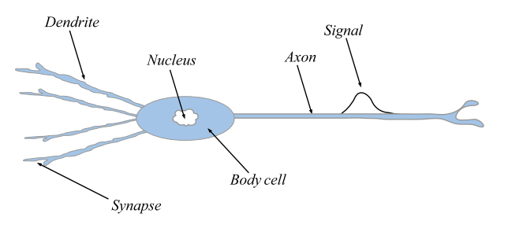
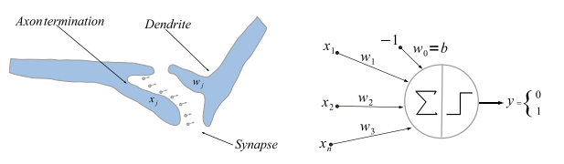

---

# TL;DR:

A neural network is a loose imitation of a theory of learning in the brain. The theory is often summarised as "Cells that fire together, wire together".

Mathematically a neural network can be described as a collection of sequences of functions which when interleaved through composition lead to reparameterisations that 'describe' an increasingly abstract feature of the input.

# Introduction

This will be the first in a series of articles that I have written for two reasons. Firstly to solidify my knowledge of the mathematical foundations of the subject. Secondly, I am posting the series online to help those, like myself, who are interested in the mathematics of deep learning but find it hard to know where to start or where to look.

I have a friend with a similar mathematical background to myself, studying for a PhD in Mathematical Physics. I would say his research interests lie in geometrically understanding physical theories (some might say he is interested in a version of [Hilbert's sixth problem](https://en.wikipedia.org/wiki/Hilbert%27s_sixth_problem)). He is also interested in the mathematical aspects of deep learning. It is to him that I aim this work and thus the level of mathematics needed is high. One does not need to have a PhD to approach the topic (I do not), but an undergraduate mathematical education will suffice.
The purpose is to provide an insight into the overlap of physics/geometry with machine learning theory. Specifically how the [paper](https://arxiv.org/pdf/1902.04615.pdf) on Gauge-CNN's uses [gauge theory](https://en.wikipedia.org/wiki/Gauge_theory) to solve some problems in modern deep learning (DL) theory.

In this first article, we will be concerned with a [rigorous mathematical definition](#multi-layer-perceptrons-as-a-sequence) of a neural network.

We start by giving a very brief & simple introduction to [Hebbian Theory](#hebbian-theory). This is a model of how brain cells react during the learning process. Continuing on to define the mathematical model for the constituent elements of neural networks, the [neuron](#single-artificial-neuron). Also looking at a simple case we define the loss function which enables 'learning' for this neuron model.

Finally, we formally define neural networks in two ways, one as a function over feature space and a set of parameters. The second definition uses a collection of sequences to inherently subsume these notions and makes clearer the process of iterative abstraction that allows a neural network to learn.

# Simplistically Imitating Biological Neural Networks

An artificial neural network (NN) is a mathematical model commonly used in machine learning. They are based on biological counterpart the neural networks of the brain. Over the past decade or so NNs have massively improved our ability to do things like [beat world champion board game players](https://deepmind.com/blog/article/alphazero-shedding-new-light-grand-games-chess-shogi-and-go) and [even teach cars to drive themselves](https://www.tesla.com/en_GB/autopilotAI).

Biological neural networks are massively connected structures of cells called neurons. The human brain contains on the order of $10^{11}$ neurons, each of which connects to approximately 6000 others![^1]

[^1]: Images taken from Calin, O., 2020. Deep Learning Architectures. Cham: Springer.

## Hebbian Theory

This [theory](https://en.wikipedia.org/wiki/Hebbian_theory) describes the role of individual neurons contribution to the brains adaption during learning.

The synapses of individual neuron cells pass chemicals to the axons of others, which either react strongly or weakly. The information of the interaction is transmitted along all the dendrites to the body cell. Where the signals are then combined, causing the neuron to fire provided a threshold is exceeded.

The formation of memories occurs under repeated signalling between neurons, i.e. when both neurons are firing, the [synapses are actually strengthened](https://en.wikipedia.org/wiki/Long-term_potentiation). Meaning that the weights are updated each time this occurs. This more finely tunes the neuron whereas there is [degradation of the synapse strength](https://en.wikipedia.org/wiki/Long-term_depression) when the neurons do not fire together.

A schematic representing the mathematical action of the neurons:

$$
\begin{aligned}
w_0=b&:\qquad &&\textrm{This bias term represents the threshold for the neuron to fire.}\\
w_i&:\qquad &&\textrm{These weights represent the strength of the interaction, called synaptic strength.}\\
x_i&:\qquad &&\textrm{These inputs represent the information from other neurons.}\\
y&:\qquad &&\textrm{This is the output \& it represents whether or not the neuron has fired.}
\end{aligned}
$$

The circle (which represents the body-cell) is split into two parts, the first $\sum$ representing the linear combination of then dendrite information, i.e. $\sum\limits_{i=1}^{n}x_iw_i$. Then the second half represents the application of what is called the **activation function** which we will denote by $\varphi$. This allows us to write the output of the neuron as

$$
y = \varphi_b\Bigg(\sum\limits_{i=1}^{n}x_iw_i\Bigg)= \varphi_0\Bigg(\sum\limits_{i=1}^{n}x_iw_i - b\Bigg)
$$

Where the activation functions are the unit step function centered at $b$ $\varphi_b$ and the [Heaviside function](https://en.wikipedia.org/wiki/Heaviside_step_function).

The point of the activation function is to map the outpoint into the set $\{0,1\}$ based on where or not $\sum\limits_{i=1}^{n}x_iw_i > b$. This model of a neuron is referred to as a **_linear perceptron_** or just a **_perceptron_**. However, the neuronal model, where we do not have such a requirement on the image of the activation function, is a strictly more general notion encompassing that of the perception.

For the neuronal model, we employ a trick to simplify notation. By considering the bias as an additional weight with input $-1$ (already done in the picture above) we can write the output as

$$
y = \varphi_0\Bigg(\sum\limits_{i=0}^{n}x_iw_i\Bigg)
$$

This trick will appear multiple times, so for brevity, I will refer to this simplification as 'zero indexing the bias'.

## Learning

Although this model is often considered oversimplified as to the true nature of neurons in the brain, we are mathematicians & physicists so oversimplified is a good place to start _insert spherical cow reference here_. This results in the [learning](https://en.wikipedia.org/wiki/Synapse#Role_in_memory) of the output function. The question is, what class of output functions can be learned in this model?

Well as we seen above, the model is simply determining whether the inequality $\sum\limits_{i=1}^{n}x_iw_i > b$ is satisfied or not. Thus the output function is a piece-wise function determining whether or not some point $(x_1, ..., x_n)$ belongs to some $n-$dimensional hyperplane.

However, the function cannot determine whether or not such a point lies within the interior of say, an n-sphere, since this would require an inequality quadratic in the inputs.

Although it is possible to learn non-linear functions provided one also uses a non-linear activation. Thus it is commonly said that activation functions are responsible for introducing non-linearities to the NNs.

---

# Single Artificial Neuron

> A single artificial neuron can be considered to be a quadruple $(X,\, W,\, \varphi,\, y)$ where $X,\, W\in\mathcal{X}$ are the input vector and weight vectors respectively belonging to some vector space $\mathcal{X}$ which is typically some finite-dimensional Euclidean space[^2]. $\varphi: \mathcal{X}\to\mathcal{Y}$ is the activation function[^4] which is used to implicitly define the output function $y=\varphi(X^TW)$.

As discussed before, it is conventional to zero index the bias. So the vectors are indexed from $0$ where the $0-$th components are just $X_0 = -1$ and $W_0=b$ is the bias.

[^2]: Although you may endow them for more structure, say that of a [Banach space](https://en.wikipedia.org/wiki/Banach_space#:~:text=12%20External%20links-,Definition,norm%20%7C%7C%20%E2%8B%85%20%7C%7C.).
[^4]: The output space $\mathcal{Y}$ is task-dependent. Meaning that choice of activation function designates $\mathcal{Y}$. It can be another vector space or simply a finite set, depending on the task at hand. For example, if one wants to separate some data into two distinct classes then one can use an activation function whose image lies in $\{0,\, 1\}$

## Learning With Linear Neurons

Suppose we want to learn/approximate some continuous function $f: K\subset\mathbb{R}^n\to\mathbb{R}^m$ where $K$ is compact. We will use a $L^2-$notion of measure for the approximation. That is, the learned affine function (the output function of a **_linear neuron_**, i.e. where $\varphi\equiv\mathbb{1}$), call it $g: K\subset\mathbb{R}^n\to\mathbb{R}^m$. $g$ best approximates $f$ when the $L^2-$distance between them

$$
C_f(X)=\int\limits_{K}\frac{dX}{2}\,|f(X)-g(X)|^2
$$

is minimised[^3]

[^3]: It is common to assume that the approximation takes place near the origin so that $g$ is not just affine but actually linear. So that $b=g(0)=f(0)=0$ . Then for a linear neuron the output function $g$ has the form $g(X)=\sum\limits_{i=1}^{n}a_ix_i$.

> This $L^2-$distance $C_f$ is defined up to a multiplicative factor (for simplicity in calculating derivatives) & is often called the **_cost_** or **_loss function_**.

Since we are interested in minimising this loss function lets look at its partial derivative w.r.t its $j-$th component $a_j$:

$$
\begin{aligned}
\partial_j\,C_f = \int\limits_{K}dX\,x_j\sum\limits_{k=1}^{n}a_kx_k - \int\limits_{K}dX\,x_jf(X)
\end{aligned}
$$

defining the matrix $\rho$ with components $\rho_{ik}=\int\limits_{K}dX\,x_jx_k$ and the vector $m$ with components $m_j=\int\limits_{K}dX\,x_jf(X)$.

Thus we can find the optimal weights for the neuron to approximate the target function by solving the Euler equation:

$$
\begin{aligned}
\nabla_aC_f &= 0 = \rho a -m \\ \implies a &= \rho^{-1}m
\end{aligned}
$$

Of course provided $\rho\in\textrm{GL}_{n}(\mathbb{R})$, that is it is invertible

---

# Networks of Artificial Neurons

We can actually layer the above mathematical model of neurons, by simply composing the learned affine functions. Such a network is called a **_multi-layer perceptron (MLP)_** or a **_feed-forward neural network_**.

## Deep Feed-Forward Networks as a Function

Suppose we have $N$ vector spaces $\mathcal{X}^{(\ell)}$ and let $\Theta^{(\ell)}$ be the set of possible parameters for each layer (denoted by $\ell$), both labelled by $\ell\in\{0, ..., N-1\}$.

These spaces are often called **_feature spaces_**, a neural network then layers these spaces connecting them with maps $\Psi^{(\ell)}$,

$$
\Psi^{(\ell)}:\mathcal{X}^{(\ell)}\times\Theta^{(\ell)}\to\mathcal{X}^{(\ell+1)}
$$

> Then combining these forms the **_neural network_**
>
> $$
> \begin{aligned}
> \Psi&:\mathcal{X}\times\Theta\to\mathcal{Y}\\ \\
> x\mapsto \underbrace{\Psi^{0}(z^{\, 0}, \theta^{\,0})}_\text{first hidden layer} \mapsto\, ...\, \mapsto&\,\underbrace{\Psi^{j}(z^{\, j}, \theta^{\,j})}_\text{$(j+1)$-st layer} \mapsto\, ...\, \mapsto\underbrace{\Psi^{N-1}(z^{N-1}, \theta^{N-1})}_\text{output layer}
> \end{aligned}
> $$

The initial layer $\ell=0$ is called the **_input layer_**, then intermediate steps $\ell\in\{1,\,...,\,N-2\}$ are referred to as **_hidden layers_** and the final layer $\ell=N-1$ is called the **_output layer_**.

Bear in mind that the set notation may be abstracting way the meaning of the domain.

That is, $\mathcal{X}$ actually the first vector space $\mathcal{X}^0$, whereas the $\Theta$ is not $\Theta^{0}$ but instead $\Theta=\Theta^{0}\times\,...\,\times\Theta^{N-1}$. That is, $\Theta$ represents the **entirety of the networks parameters** and $\mathcal{X}$ is the **_input space_**.

We can actually abstract away this notion of the set of parameters altogether. Since our layers of the network are made up of individual neurons as defined above, we have a more abstract definition of a MLP, which actually clarifies the essence of a neural network.

## Deep Feed-Forward Networks as a Sequence

Consider the $\mathcal{X}^{(\ell)}-$valued function spaces for the $\ell-$th layer

$$
\mathcal{F}^{(\ell)} = \{f\,|\,f:\underbrace{\mathcal{X}^{(\ell)}\times\,...\,\times\mathcal{X}^{(\ell)}}_{d^{(\ell)}-\text{times}}\to \mathcal{X}^{(\ell)}\}
$$

Define some affine function on each neuron in this layer $\alpha^{(\ell)}_i: \mathcal{X}^{(\ell)}\to\mathcal{X}^{(\ell+1)}$ which decomposes as $\alpha^{(\ell)}_i(x^{(\ell)})=(x^{(\ell)})^Tw_i^{(\ell)}$ with the usual convention of zero indexing the bias term.

In general, each neuron in a layer can have distinct activation functions; however, it is common to choose a single activation function per layer[^5]. For the sake of generality, let's assume we do indeed have distinct activations since the latter is a simple restriction.

[^5]: I believe this choice is due to improved computational performance.

Let the activation functions of each neuron in the $\ell-$th layer be $\{\varphi_i^{(\ell)}\,|\, i\in D^{(\ell)}\}$, where $D^{(\ell)}$ is an indexing set with $|D^{(\ell)}|=d^{(\ell)}$ the number of neurons in the $\ell-$th layer.

Now let $\alpha^{(\ell)}:\mathcal{F}^{(\ell)}\to\mathcal{F}^{(\ell+1)}$, which can be thought of as a vector of all the affine functions in a layer. Then also define $\varphi^{(\ell)}$ a layer-wide combination of the activation function. Then these compose to act as a map between layers, that is,

$$
x^{(\ell+1)} = \varphi^{(\ell)}\circ\alpha^{(\ell)}(x^{(\ell)})
$$

The action of this neuron-wise is

$$
x^{(\ell+1)}_j = \varphi^{(\ell)}_j\circ\alpha^{(\ell)}_j(x^{(\ell)})
$$

Finally a **_feed-forward neural network with $L$ layers_** can then be defined as follows:

> Let $D=\{D^{(1)},\,...,\,D^{(L)}\}$ and then a sequence of maps $(f^{(i)})_{i\in D}$, together with two other sequences, one of activation functions $(\varphi^{(i)})_{i\in D}$ and one of affine functions $(\alpha^{(i)})_{i\in D}$, is a neural network when maps are defined iteratively:
>
> $$
> f^{(\ell)} = \varphi^{(\ell)}\circ\alpha^{(\ell)}\circ f^{(\ell-1)}
> $$
>
> where $f^{(0)}$ is the input.

The network is said to be $L$ layers **_deep_** and $\max\limits_{{\ell\in D}}(d^{(\ell)})$ **_wide_**. The iterative nature may be viewed as forcing information forward throughout the network, hence **_feed-forward_**.

What is clearer from this representation is the fact that a deep feed-forward neural network progressively 'collects' a set of **_increasingly abstract reparameterisations_**, $f^{(\ell)}$. This is due to the action of all the parameterised functions in both the affine and activation sequences.

# Concluding Remarks

This may seem like a painstaking amount of abstraction for something that is essentially repeatedly summing and applying some function. But the advantage is the abstraction immediately distils the essence of the process. Successive reparameterisation.

Without the non-linearities provided by the activation functions, MLPs meet serious limitations. In fact, it can be shown that a network with only linear neurons can be recast as a single layer network. In that case, we lose the reparameterisation property of the network, which allows us to learn important features of the input.

The next article on convolutional neural networks will piggyback off this idea and add some more geometry into the mix. These are the two essential ingredients for understanding how gauge theory can help in deep learning. So hopefully in the third article, we will confront the work of [Taco Cohen et al](https://arxiv.org/pdf/1902.04615.pdf).

This article, of course, leaves many questions unanswered about neural networks. We checked what functions we can learn with a single neuron. What about a neural network? What about the process of learning these functions? Must we restrict ourselves to an $L^2-$sense of norm as we did for the linear neuron? What do we pick up by extending our feature spaces from vector spaces to, say Banach spaces for example?

I hope to answer some of these questions for myself and also to share them when I do.

---

# References

This article is my personal take on some sections from a combination of the following books/papers:

- Calin, O., 2020. Deep Learning Architectures. Cham: Springer.
- Anthony, M. and Bartlett, P., 2010. Neural Network Learning. Cambridge: Cambridge University Press.
- Celledoni, E., Ehrhardt, M.J., Etmann, C., McLachlan, R.I., Owren, B., Schönlieb, C.B. and Sherry, F., 2020. Structure preserving deep learning. arXiv preprint [arXiv:2006.03364](https://arxiv.org/pdf/2006.03364.pdf).

---

<!-- omit in toc -->

## I hope you found the article useful.

I am still learning the subject myself, so if you had problems with the material please reach out! Or indeed if you any have any other interesting paper/book/articles suggestions please pass them along.

To connect with me or find more content similar to this article, do the following:

- Check out my personal website www.petereferguson.co.uk
- Follow my [Medium]()
- Leave a comment!
